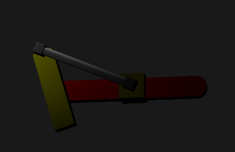
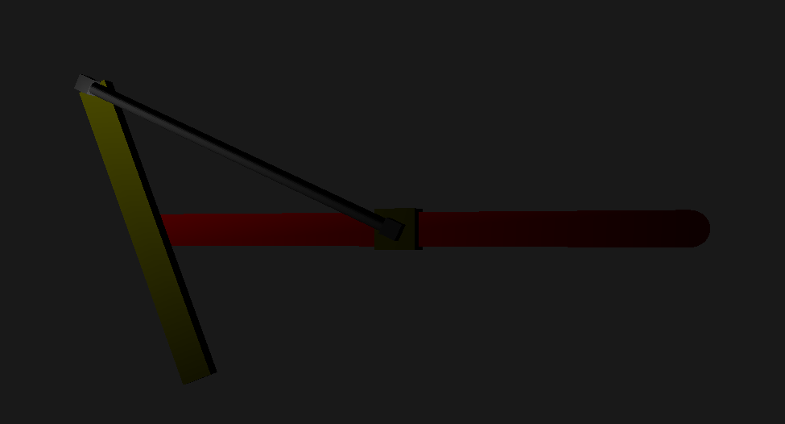

# Systeme Bielle Manivelle

 

# controles
- 0: flat lighting (default)
- 1: vertex lighting (goureaud)
- 2: pixel lighting (phong)
- 3: desactiver ombrage speculaire
- 4: activer ombrage speculaire
- 5: desactiver spotlight
- 6: activer spotlight 
- 7: la spotlight bouge de haut en bas (default)
- 8: la spotlight tourne
- Z: Avancer
- Q: Reculer
- S: Gauche
- D: Droite
- haut: augmenter la longueur du bras
- bas: baisser la longueur du bras
- gauche: baisser la longueur du cylindre
- droite: augmenter la longueur du cylindre
- E: Activer le mecanisme
- R: Augmenter la vitesse de rotation
- F: Baisser la vitesse de rotation
